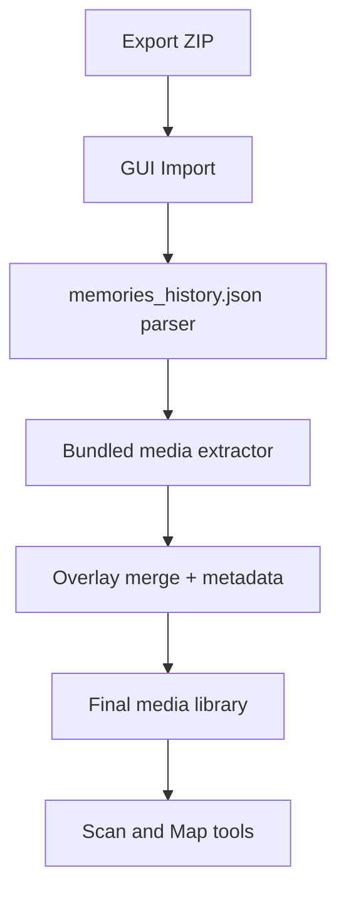
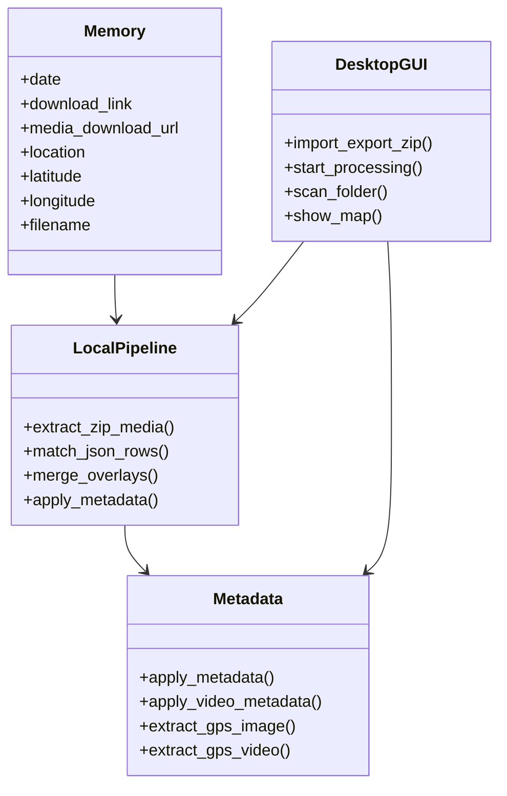

# Snapchat Memories Keeper (SMK)

Process Snapchat Memories exports locally on your PC: extract bundled media, merge overlays, embed capture metadata (time + GPS where available), and browse results on a map.

## What This App Does

- Imports Snapchat export ZIP files and reads `memories_history.json`
- Processes **bundled exports** (media files inside the ZIP) fully offline
- Detects real file type from content (not only extension)
- Merges Snapchat overlay filters into photos and videos when present
- Embeds metadata for supported formats:
  - Images: EXIF date + GPS (`.jpg`, `.jpeg`)
  - Video: QuickTime/MP4 tags (`.mp4`, `.mov`)
- Quarantines suspicious tiny or corrupt files
- Scans existing folders for extension/GPS analysis and an optional map view

## Important Notes

- This project is **not affiliated with Snap Inc.**
- This app processes files **locally on your machine** - no uploads, no telemetry.
- **Offline-first:** memory processing needs no internet. The optional GPS map may load map tiles when you open File Checker.
- **Bundled exports only:** link-only exports (JSON with download URLs but no media in the ZIP) are not supported.
- Same-day **photos** are paired to JSON using **ZIP entry timestamps** Snapchat leaves on the files (videos use each file’s embedded capture time). Prefer processing from the original export ZIPs — copying/extracting in a way that resets file times can fall back to weaker ordering.
- Snapchat `My Eyes Only` content is not included in normal Memories export flow. Move content into Memories first if you need it included.

## Platform Support

| Platform | Status |
|----------|--------|
| **Windows 10/11 (64-bit)** | **Official** — built, tested, and supported |
| **macOS** | **Beta / untested** — experimental packaging only |
| **Linux** | **Beta / untested** — experimental packaging only |
| iOS / Android | Not planned (this is a desktop PyQt app, not an iPhone/iPad app) |

macOS and Linux betas are **not confirmed** by the maintainer. There is no reliable maintainer test coverage on those systems yet (maybe months from now). Expect breakage. Prefer Windows for real use.

### Beta builds (macOS / Linux)

From source on the target OS:

```bash
chmod +x build_smk_unix.sh scripts/fetch_ffmpeg.sh
./build_smk_unix.sh
```

Or run the GitHub Action **“Beta unix builds (untested)”** (`workflow_dispatch`) and download the artifacts. Every beta folder includes `BETA_UNTESTED_README.txt`.

## Contributing

**Contributors are very welcome.** This project is open to help with:

- Making **macOS and Linux** betas actually reliable (packaging, testing, bug reports)
- Bug fixes, performance, and code quality on Windows
- Docs and UX polish

Please open an issue first for large ports. See [`CONTRIBUTING.md`](CONTRIBUTING.md).

## Quick Start (User)

**Official release — no extra software needed**

1. Download the installer or portable ZIP from [Releases](https://github.com/LasHSHS/SMK/releases).
2. Open **Snapchat Memories Keeper** (`SMK.exe`).
3. Request your Snapchat data export (Memories + JSON). Steps are also in the app Guide / Help.
4. Select the export ZIP (or folder with all ZIP parts).
5. Click Start — processing runs locally on your PC.

No Python, pip, ffmpeg, or other tools required in the official Windows build.

**Windows SmartScreen:** Windows may warn that the app is unsigned. That is normal. Use **More info → Run anyway** if you got it from the [GitHub release](https://github.com/LasHSHS/SMK/releases). Check the SHA-256 on the release page. Official builds stay on GitHub only (no Microsoft Store / no paid code signing).

## Build & Release

See **`agent-docs/ALL_IN_ONE_PACKAGING.md`** for the canonical packaging rules (bundle everything; file size is not a concern).

See **`agent-docs/DISTRIBUTION_GUIDE.md`** for the release checklist.

```powershell
powershell -ExecutionPolicy Bypass -File .\build_smk.ps1
```

Output: `dist/smd/SMK.exe` (all-in-one portable folder; package dir name stays `smd`).

macOS/Linux experimental: `./build_smk_unix.sh` (see Platform Support — beta / untested).

## Architecture





## Reliability Roadmap

- **Phase A (stability hardening):** crash fixes, path portability, skip/stat correctness, metadata flow integrity
- **Phase B (safe UX improvements):** clearer status/reporting, better issue summaries, beginner-first wording
- **Phase C (visual polish):** modern UI refinements after behavior is stable

## Security & Trust Checklist (Release)

- Publish SHA-256 checksums for each release binary
- Say clearly if the build is unsigned (SmartScreen warning)
- Add clear "no telemetry" statement if you keep that policy
- Add license + trademark notice (name/logo usage policy)
- Code sign when a certificate is available (new release with signed files)

